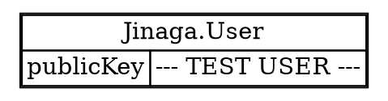
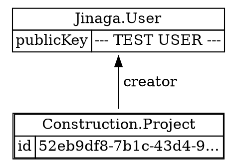

The core unit of data in Jinaga is a *fact*.
A fact is an immutable record of an event, decision, or state change.
Let's start simple.
When the user logs into your application, that's a fact.

```typescript
const { userFact: user, profile } = await testClient.login<User>();
```



Each fact has a type (`Jinaga.User` in this case) and a set of properties (`publicKey` for this example).

The `Jinaga.User` type is defined in the Jinaga library.
But, of course, you can define your own types.
Write a class with a static `Type` as the type name.
Declare a `type` instance variable initialized to that value.
Then declare a constructor taking all of the properties of the fact.

```typescript
class Project {
  static Type = "Construction.Project" as const;
  type = Project.Type;

  constructor(public creator: User, public id: string) {}
}
```

To create an instance of this fact, call `fact` on the Jinaga client.
This method is asynchronous because it will save the fact to the local store and notify the replicator to synchronize it with other clients.

```typescript
const projectA = await testClient.fact(new Project(user, crypto.randomUUID()));
```



## Build a Model

Before you can use these fact types in an application, you have to build a model.
Start by adding all of your types to a model builder.

```typescript
const constructionModel = (b: ModelBuilder) => b
  .type(Project, m => m
    .predecessor("creator", User)
  )
  ;
```

Then you can compose a set of declarations into one model.

```typescript
const model = buildModel(b => b
  .with(constructionModel)
);
```