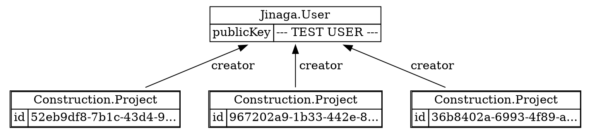

When we defined the `Construction.Project` type, we used `Jinaga.User` as one of its properties.
That made it a *predecessor*.
In this case, the meaning of that predecessor relationship is that the user created the project.

Once you have predecessors, you can query for facts that are related to them.
These, as you might have guessed, are called *successors*.
You'll find the `Successors` extension method in the `Jinaga.Extensions` namespace.

Let's query for all projects that a user has created.

```csharp
using Jinaga.Extensions;

// Create a couple more projects.
Project projectB = await j.Fact(new Project(user, Guid.NewGuid()));
Project projectC = await j.Fact(new Project(user, Guid.NewGuid()));

var projectsCreatedByUser = Given<User>.Match(u =>
    u.Successors().OfType<Project>(p => p.creator)
);

ImmutableList<Project> projects = await j.Query(projectsCreatedByUser, user);
```



Let's break down that specification.
Start with `Given` and the parameter type.
Then use `Match` to write an expression that matches the facts you want.

The `Successors` extension method finds all successors `OfType<T>` related to the given predecessor.
Provide a lambda that shows how the successors relate to the predecessor.