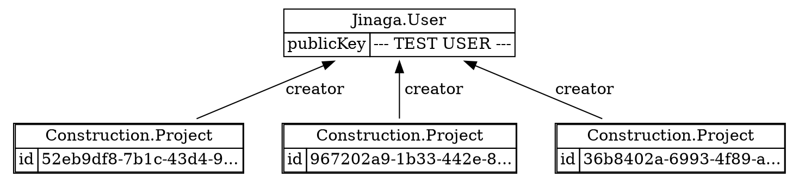
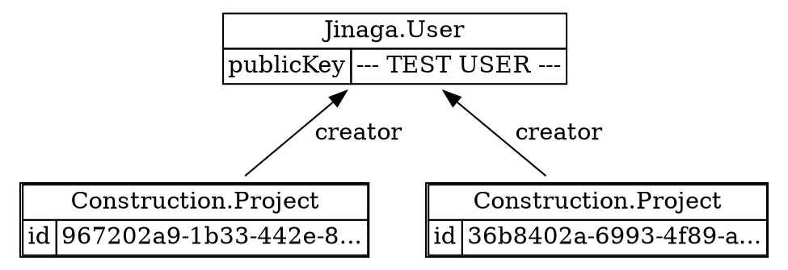

Facts are immutable, so you cannot really delete them.
Instead, you can create a new fact that marks its predecessor as deleted.

```typescript
class ProjectDeleted {
  static Type = "Construction.Project.Deleted" as const;
  type = ProjectDeleted.Type;

  constructor(public project: Project, public deletedAt: Date) {}
}

const projectADeleted = await j.fact(new ProjectDeleted(projectA, new Date()));
```

Don't forget to include the `ProjectDeleted` type in your model:

```typescript
const constructionModel = (b: ModelBuilder) => b
  .type(Project, m => m
    .predecessor("creator", User)
  )
  .type(ProjectDeleted, m => m
    .predecessor("project", Project)
  )
  ;
```

On its own, this fact does not do anything.

```typescript
const projects = await j.query(projectsCreatedByUser, user);
```



But if you include it in the specification, it will filter out the predecessor from the results.

```typescript
const projectsCreatedByUser = model.given(User).match(u =>
  u.successors(Project, p => p.creator)
    .notExists(p => p.successors(ProjectDeleted, d => d.project))
);

const projects = await j.query(projectsCreatedByUser, user);
```



Now if you are *really* concerned about facts never being truly deleted, there is a way to *purge* unreachable facts.
We'll save that for later.
