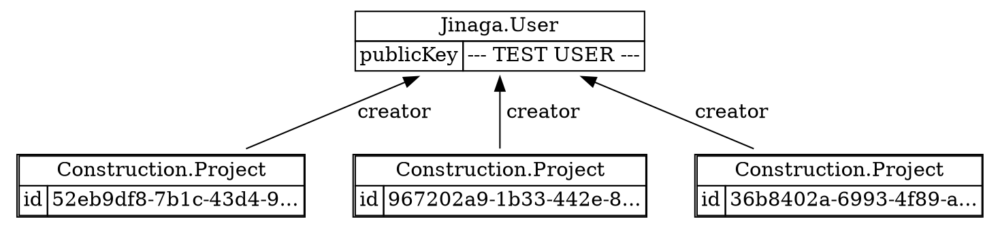

For completion, let's talk about restoring a deleted fact.
You do this by defining yet another successor.

```csharp
[FactType("Construction.Project.Restored")]
public record ProjectRestored(ProjectDeleted deleted);

await j.Fact(new ProjectRestored(projectADeleted));
```

Again, you need to add this fact to the specification for it to have an effect.

```csharp
var projectsCreatedByUser = Given<User>.Match(u =>
    u.Successors().OfType<Project>(p => p.creator)
        .Where(p => !p.Successors().OfType<ProjectDeleted>(d => d.project).Any(
            d => !d.Successors().OfType<ProjectRestored>(r => r.deleted).Any()))
);

ImmutableList<Project> projects = await j.Query(projectsCreatedByUser, user);
```



And it's back!

### Pattern Extensions

Because these are such common patterns, Jinaga provides some shorthand extensions to make them easier to write.
You can find these in the `Jinaga.Patterns` namespace.

```csharp
using Jinaga.Patterns;

var projectsCreatedByUserWithoutRestore = Given<User>.Match(u =>
    u.Successors().OfType<Project>(p => p.creator)
        .WhereNotDeleted((ProjectDeleted d) => d.project)
);

var projectsCreatedByUserWithRestore = Given<User>.Match(u =>
    u.Successors().OfType<Project>(p => p.creator)
        .WhereNotDeletedOrRestored((ProjectDeleted d) => d.project,
            (ProjectRestored r) => r.deleted)
);
```