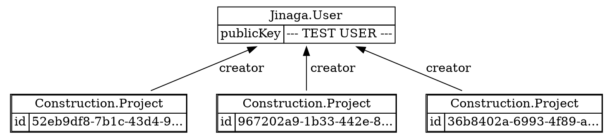

For completion, let's talk about restoring a deleted fact.
You do this by defining yet another successor.

```typescript
class ProjectRestored {
  static Type = "Construction.Project.Restored" as const;
  type = ProjectRestored.Type;

  constructor(public deleted: ProjectDeleted) {}
}

await j.fact(new ProjectRestored(projectADeleted));
```

Don't forget to include the `ProjectRestored` type in your model:

```typescript
const constructionModel = (b: ModelBuilder) => b
  .type(Project, m => m
    .predecessor("creator", User)
  )
  .type(ProjectDeleted, m => m
    .predecessor("project", Project)
  )
  .type(ProjectRestored, m => m
    .predecessor("deleted", ProjectDeleted)
  )
  ;
```

Again, you need to add this fact to the specification for it to have an effect.

```typescript
const projectsCreatedByUser = model.given(User).match(u =>
  u.successors(Project, p => p.creator)
    .notExists(p => p.successors(ProjectDeleted, d => d.project)
      .notExists(d => d.successors(ProjectRestored, r => r.deleted)))
);

const projects = await j.query(projectsCreatedByUser, user);
```



And it's back!

The query logic can be broken down as follows:
- Find all projects created by the user
- Exclude projects that have a `ProjectDeleted` successor
- Unless that deletion has a `ProjectRestored` successor (using nested `notExists`)

This creates a complete delete/restore cycle where deleted items can be brought back into the active set.