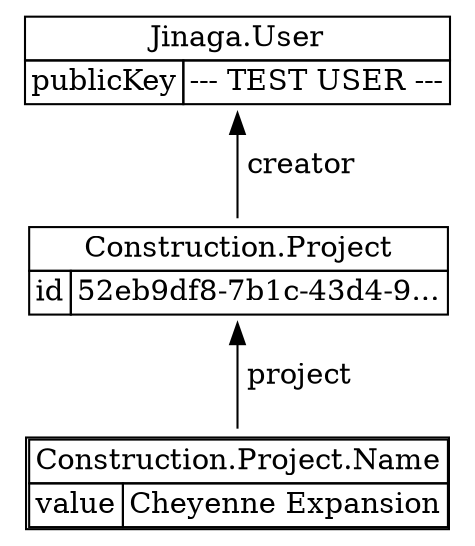
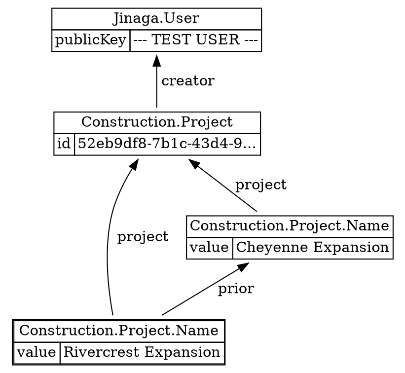
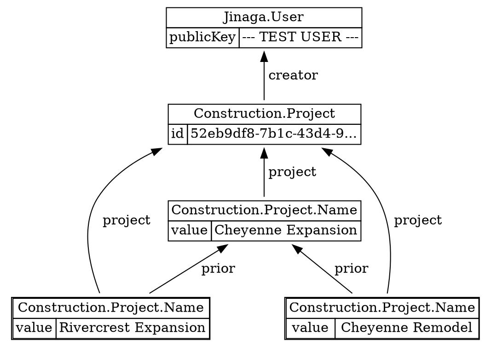
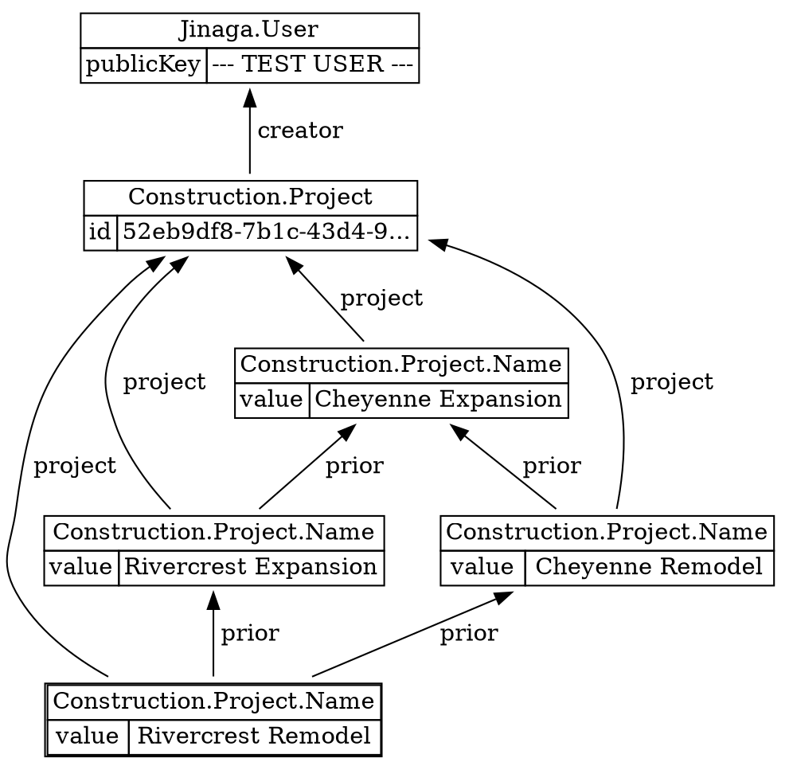

Facts are immutable.
So you don't want to put a property like `name` in a project.
You would never be able to change it!

Instead, you can define a successor that represents changing the project name.
This is the pattern we use.

```csharp
[FactType("Construction.Project.Name")]
public record ProjectName(Project project, string value, ProjectName[] prior);
```

That `prior` array let's you overwrite a prior value.
The first value will have an empty array, which means there is no prior value.

```csharp
ProjectName projectAName1 = await j.Fact(new ProjectName(projectA, "Cheyenne Expansion", []));
```



To change the name, you create a new fact that has the old name as its prior value.

```csharp
ProjectName projectAName2 = await j.Fact(new ProjectName(projectA, "Rivercrest Expansion", [projectAName1]));
```



To query for the current name, you look for a successor that does not appear in any list of `prior` values.

```csharp
var namesOfProject = Given<Project>.Match(p =>
    p.Successors().OfType<ProjectName>(n => n.project)
        .Where(p => !p.Successors().OfType<ProjectName>(next => next.prior).Any())
);

ImmutableList<ProjectName> names = await j.Query(namesOfProject, projectA);

names.Select(n => n.value)
```

```
[ "Rivercrest Expansion" ]
```

Jinaga provides a shorthand for this pattern as well.

```csharp
var namesOfProject = Given<Project>.Match(p =>
    p.Successors().OfType<ProjectName>(n => n.project)
        .WhereCurrent((ProjectName next) => next.prior)
);
```

## Concurrent Edits

The reason that we use the `prior` array is to handle concurrent edits.
If a user on a different device changes the name of the project, you will get a fork in the graph.

```csharp
ProjectName projectAName3 = await j.Fact(new ProjectName(projectA, "Cheyenne Remodel", [projectAName1]));
```

S



That will result in more than one successor matching the specification.

```csharp
ImmutableList<ProjectName> names = await j.Query(namesOfProject, projectA);

names.Select(n => n.value)
```

```
[ "Rivercrest Expansion", "Cheyenne Remodel" ]
```

This is how you can recognize that there have been concurrent edits.
It also shows you the candidate values for the project name.

To merge, identify the correct value.
Then create a new fact that sets the correct value and has all candidates in its `prior` array.

```csharp
ProjectName projectAName4 = await j.Fact(new ProjectName(projectA, "Rivercrest Remodel", names.ToArray()));
```



And now only one successor matches the specification.

```csharp
ImmutableList<ProjectName> names = await j.Query(namesOfProject, projectA);

names.Select(n => n.value)
```

```
[ "Rivercrest Remodel" ]
```