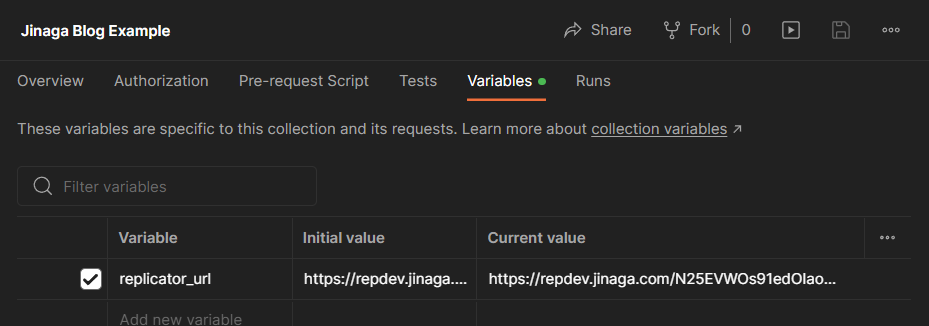
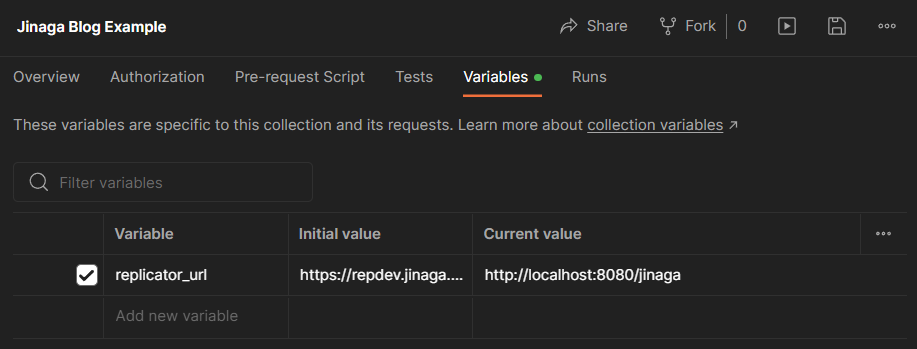

The Jinaga Replicator is a single machine in a network.
It stores and shares facts.
To get started, create a Replicator of your very own on the [Jinaga Portal](https://dev.jinaga.com/).

When you publish a Replicator, you will be given a URL.
Use a tool like [httpYac](https://httpyac.github.io/) or [Postman](https://www.postman.com/) to `POST` messages to `https://repdev.jinaga.com/xyz123.../write` and `/read`.

You can download the <a href="" download>example httpYac files</a> or <a href="/Jinaga%20Blog%20Example.postman_collection.json" download>example Postman collection</a> to try it yourself.
Edit the example and enter your own replicator URL.

For httpYac, add your own `env.local` file with the following values:

```
replicatorUrl=https://repdev.jinaga.com/xyz123...
```

For Postman, enter the replicator URL in the Postman collection variables.



## Docker

If you would like to keep everything local, you can also run the Replicator in Docker.
Install [Docker Desktop](https://www.docker.com/products/docker-desktop/).
Then run the following commands from the command prompt (Mac Terminal, Windows PowerShell, or WSL2).

```
docker pull jinaga/jinaga-replicator
docker run --name my-replicator -p8080:8080 jinaga/jinaga-replicator
```

This creates and starts a new container called `my-replicator`.
The container is listening at port 8080 for commands.
Use a tool like [Postman](https://www.postman.com/) to `POST` messages to `http://localhost:8080/jinaga/write` and `/read`.

You can download an <a href="/Jinaga%20Blog%20Example.postman_collection.json" download>example Postman collection</a> to populate your replicator.

If you are using httpYac, create a file called `.env.local` in the same folder as the request files.
Copy the following configuration settings from your replicator.

```
replicatorUrl=https://repdev.jinaga.com/xxxx

oauth2_authorizationEndpoint=https://repdev.jinaga.com/xxxx/auth/apple
oauth2_tokenEndpoint=https://repdev.jinaga.com/xxxx/auth/token
oauth2_clientId=xxxx
oauth2_usePkce=true
```

If you are using Postman, edit the collection variables and enter the replicator URL `http://localhost:8080/jinaga`.


