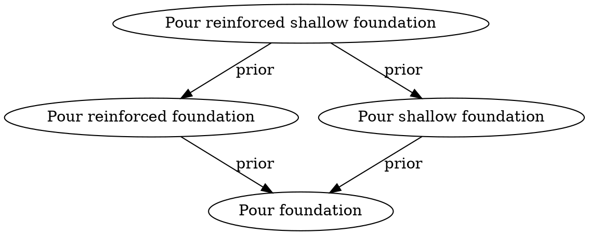

In most systems, when something changes, we update a field in a record. In Jinaga, we don’t update—we add. Every change is a new fact.

This lets us:
  * Keep a complete history of what happened
  * Avoid overwriting other users’ changes
  * Reconcile concurrent edits automatically

Let’s revisit task descriptions to see how this works.

---

### First Description

When a task is first created, someone adds a description:

```typescript
const initial = new TaskDescription(task, "Pour foundation", []);
await j.fact(initial);
```

This description has no prior values—it’s the first one.

---

### Updating the Description

Later, someone updates the task to be more specific:

```typescript
const revised = new TaskDescription(task, "Pour concrete foundation", [initial]);
await j.fact(revised);
```

This new fact refers to the old one in its prior list. Jinaga now understands that the new fact supersedes the earlier one.

---

### Concurrent Edits

What if two people make changes offline?

```typescript
const v1 = new TaskDescription(task, "Pour foundation", []);
await j.fact(v1);

const alt1 = new TaskDescription(task, "Pour reinforced foundation", [v1]);
const alt2 = new TaskDescription(task, "Pour shallow foundation", [v1]);

await j.fact(alt1);
await j.fact(alt2);
```

Now there are two competing updates. Both point to the same prior version. Jinaga doesn’t choose a winner—it shows both as current until one is replaced.

You can later resolve the conflict:

```typescript
const resolved = new TaskDescription(task, "Pour reinforced shallow foundation", [alt1, alt2]);
await j.fact(resolved);
```

This supersedes both versions and becomes the only current one.

---

### Graph View



This structure models not just the latest state, but the full history and intent behind each change.

By modeling updates as new facts with prior links, your app gains version history, audit trails, and conflict resolution—all without writing sync or merge logic.
