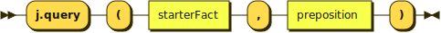
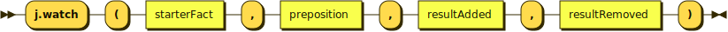
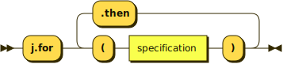
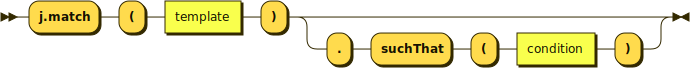
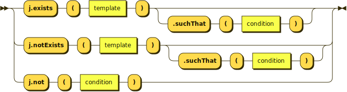

## query:

## watch:

## preposition:

## specification:

## condition:

<!--

Diagrams made with  https://bottlecaps.de/rr/ui .
Then export to 'XHTML + SVG' .
Next open the exported XHTML file in a browser.
Finally save each individual image as svg using the right-click popup menu.

Options @ https://bottlecaps.de/rr/ui :
=======================================
Color: #FFDB4D
Hue offset 14°
Graphics width: 1000px
Disable all checkboxes

Source/Grammar to be pasted in "Edit Grammar" @ https://bottlecaps.de/rr/ui :
============================================================================

query    ::=  'j.query' '(' starterFact ',' preposition ')'

watch    ::=  'j.watch' '(' starterFact ',' preposition ',' resultAdded ',' resultRemoved ')'

preposition ::= 'j.for' '(' specification ')'   ('.' 'then' '(' specification ')' )*

specification ::= 'j.match' '(' template ')' ('.' 'suchThat' '(' condition')' )?

condition ::=   'j.exists' '(' template ')' ('.' 'suchThat' '(' condition ')' )? | 'j.notExists' '(' template ')'  ('.' 'suchThat' '(' condition ')' )? | ('j.not' '(' condition ')')

-->
