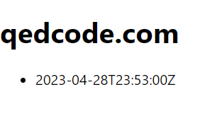

Let's read some posts from the Replicator and show those on the site component.
First we need to write a specification that matches posts of a site.
A specification begins with the model, and matches facts of a particular type.
Define this specification at the top of `SiteContainer.tsx`:

```tsx
import { model } from '../model';
import { Post, Site } from '../model/blog';

const postsInSite = model.given(Site).match(site =>
  site.successors(Post, post => post.site)
);
```

Let's break this down.
Starting from the model, we'll define a specification that takes a given `Site`.
It matches facts based on a function.
The `site` is the parameter.

In this function, we can get all facts of type `Post`.
But we can't stop there.
We have to join them to the `site` parameter.
This gives us only the posts that are related to the site.

Now we can use this specification to get the posts for the site.
We do this with the hook `useSpecification`.
Call this hook in the `SiteContainer` component:

```tsx
import { useSpecification } from 'jinaga-react';
import { j } from '../jinaga-config';

export function SiteContainer({ site }: SiteContainerProps) {
  const { loading, data, error } = useSpecification(j, postsInSite, site);
  //...
}
```

Hover over each of those variables to see their types.
The `loading` variable is a boolean that indicates whether the specification is still loading.
The `data` variable is either a `Post[]` or `null`.
And the `error` variable is either an `Error` or `null`.

We can use these fields to determine what to render.
In React it looks like this:

```tsx
  return (
    <div>
      <h1>{site?.domain}</h1>
      { loading ? <p>Loading...</p> : null }
      { error ? <p>Error: {error.message}</p> : null }
      { data ? <ul>
        { data.map(post =>
          <li key={post.createdAt.toString()}>{post.createdAt.toString()}</li>
        ) }
      </ul> : null }
    </div>
  );
```

In React Native:

```tsx
  return (
    <View>
      <Text>{site?.domain}</Text>
      { loading ? <Text>Loading...</Text> : null }
      { error ? <Text>Error: {error.message}</Text> : null }
      { data ? <FlatList
        data={data}
        renderItem={({ item }) => <Text>{item.createdAt.toString()}</Text>}
        keyExtractor={item => item.createdAt.toString()}
      /> : null }
    </View>
  );
```

If you have initialized your replicator using the [write endpoint](../../replicator/write/), then you should have a post.
Refresh the page, and that post should appear.



Well, it will appear as a date, but that's a start.