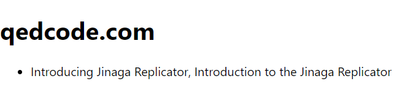

We want to see the title of each post on the site.
That means that for each post, we need a sub-specification that matches the title.
Use the `select` method to get facts of type `PostTitle`.

```tsx
const postsInSite = model.given(Site).match((site, facts) =>
  facts.ofType(Post)
    .join(post => post.site, site)
    .select(post => ({
      hash: j.hash(post),
      titles: facts.ofType(PostTitle)
        .join(title => title.post, post)
        .select(title => title.value)
    }))
);
```

The `select` method takes a function that projects a `post` into a new object.
We'll store the hash of the post in the `hash` field.
And we'll create a sub-specification to get the `titles`.

A sub-specification starts with facts of a particular type.
In this case, we want to get facts of type `PostTitle`.
Just as before, we have to join these facts to a known parameter.
In this case, we want to join them to the `post`.

In this sub-specification, we are only interested in the `value` field of the `PostTitle`.
So we'll use the `select` method to project the string.

Now we can use this revised specification.
Go back to this line:

```tsx
const { loading, data, error } = useSpecification(j, postsInSite, site);
```

Hover over the `data` variable to see its new type.

```typescript
const data: {
    hash: string;
    titles: string[];
}[] | null
```

Now instead of a `Post[]`, we have an array of objects.
Each object has a `hash` field and a `titles` field.
The `titles` field is an array of strings.

These are the candidate titles of the post.
If there are multiple titles, then a concurrent edit has occurred.
We'll have to decide how to resolve that conflict.
Let's resolve it by listing all of the candidate titles.

In React:

```tsx
  { data ? <ul>
    { data.map(post =>
      <li key={post.hash}>{post.titles.join(', ')}</li>
    ) }
  </ul> : null }
```

In React Native:

```tsx
  { data ? <FlatList
    data={data}
    renderItem={({ item: post }) =>
      <Text key={post.hash}>{post.titles.join(', ')}</Text>
    }
  /> : null }
```

Run the application and see the titles of the posts.



If you followed the instructions while writing to the replicator, then you should see two titles for the post.
That's not right.
One of them should have replaced the other.
Let's fix that.