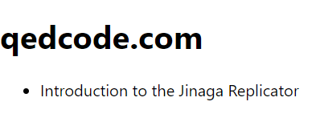

The reason that the app is displaying all versions of a post title is that we did not filter out the prior versions.
We can do that with an existential condition `notExists`.
We only want the `PostTitle` facts that are not the `prior` of another `PostTitle`.

```tsx
const postsInSite = model.given(Site).match((site, facts) =>
  facts.ofType(Post)
    .join(post => post.site, site)
    .select(post => ({
      hash: j.hash(post),
      titles: facts.ofType(PostTitle)
        .join(title => title.post, post)
        .notExists(title => facts.ofType(PostTitle)
          .join(next => next.prior, title)
        )
        .select(title => title.value)
    }))
);
```

Take a look at the app now.
You should see only the latest version of the post title.



That's how you'll build an app using Jinaga.
Build something awesome!