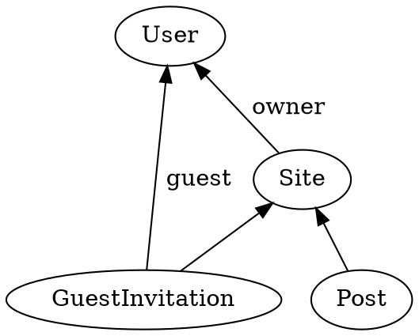

An authorization function takes an `AuthorizationRules` object as a parameter.

```typescript
const authorization = (a: AuthorizationRules) => a
  .any(AnybodyCanCreate)
  .no(NobodyCanCreate)
  .type(PredecessorCanCreate, x => x.predecessor)
  .type(SiblingCanCreate, siblingSpecification)
  .with(otherAuthorizationFunction)
  ;
```

It defines rules using the `any`, `no`, and `type` methods.
It composes other authorization functions using the `with` method.

### AuthorizationRules.any

This rule allows any user to create facts of the given type.
This cannot be combined with other rules for the same type.

```typescript
const authorization = (a: AuthorizationRules) => a
  .any(AnybodyCanCreate)
  ;
```

### AuthorizationRules.no

This rule forbids any user from creating facts of the given type.
This cannot be combined with other rules for the same type.

```typescript
const authorization = (a: AuthorizationRules) => a
  .no(NobodyCanCreate)
  ;
```

### AuthorizationRules.type

This rule allows certain users to create facts of the given type.
Pass a function or specification that selects the users who can create the fact.

If the creator of the fact is a predecessor, pass a function that selects the predecessor.

```typescript
const authorization = (a: AuthorizationRules) => a
  .type(Post, x => x.site.owner)
  ;
```

If the creator of the fact is *not* a predecessor, pass in a specification that matches authorized users.

For example, suppose that guests can be invited to post on a site.



This authorization rule allows guest bloggers to post to the site.

```typescript
const guestBloggers = model.Given(Post).match((post, facts) =>
  facts.ofType(GuestInvitation)
    .join(invitation => invitation.site, post.site)
    .selectMany(invitation => facts.ofType(User)
      .join(user => user, invitation.guest)
    )
);

const authorization = (a: AuthorizationRules) => a
  .type(Post, guestBloggers)
  ;
```

This kind of rule can be combined with other rules for the same type.
A user can create a fact if they match any of those rules.

### AuthorizationRules.with

Compose authorization functions using the `with` method.

```typescript
const otherAuthorizationFunction = (a: AuthorizationRules) => a
  // ...
  ;

const authorization = (a: AuthorizationRules) => a
  .with(otherAuthorizationFunction)
  ;
```

You will typically build your model in sections.
Each section will define a set of types and authorization rules.
Then you will compose those sections together to create the final model.
