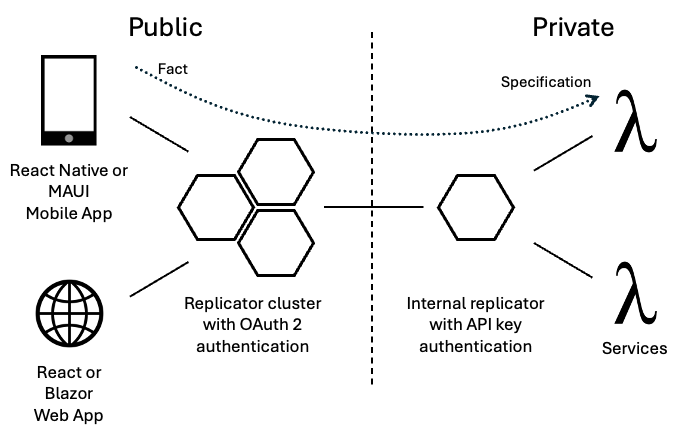

Imagine coding a mobile app as if the data were already on the device.
Or writing a web app that loads data from the local store, not the server.
Imagine not maintaining a REST API.

How much faster could you build your app?

Write code only on the edge using Jinaga.
Deploy a network of Jinaga Replicators to move data between devices and back-end services.

You will never have to write a REST API for your app.
You won't need to maintain a database schema.
And you won't need to set up queues or topics to get data to your services.
