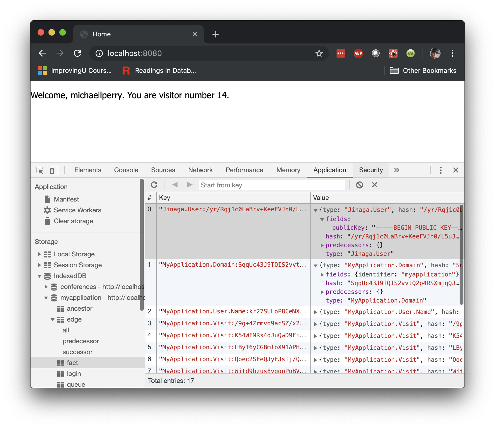

Open up the *Application* tab again, but this time let's look at the *IndexedDB* section.
In there, you will find a collection called *myapplication*, which contains several tables.
Click on the table called *facts*.



Within this collection, you will see one fact that is the `Jinaga.User`.
It represents your identity, since you are the person who logged in using Twitter.
Expand this fact, and you will see it has fields.
More precisely, it has one field, the `publicKey`.
Jinaga randomly assigned this public key to you when you logged in using Twitter.

Next look at the fact of type `MyApplication.User.Name`.
You will see that it has a single field -- called `value` -- which holds a string that you might recognize.
As exciting as this is, the even more exciting part is that the name pas `predecessors`.
One of these predecessors is called `user`, and if you compare the hash carefully you will see that it points back to the previous fact.

## Creating Facts

What you see here is the storage format for a fact.
In code, they actually appear in a more direct and useful form.
You can see how one of these is created in `src/shared/model/user.js`.
Pay special attention to the `UserName` constructor.
This constructs a JavaScript object having a `type`, `user`, `value`, and `prior` field.

The constructor is called in `src/client/components/user-container.jsx`.
You can flip back and forth between this constructor and its call site to see how this object is created.
The `type` will always be `'MyApplication.User.Name'`, as given by the constant.
The `user` will be the user fact.
The `value` field is the user handle that comes back from Twitter when they log in.
And the `prior` field is an array.

The JavaScript object will end up looking something like this:

```javascript
{
  type: "MyApplication.User.Name",
  user: {
    type: "Jinaga.User",
    publicKey: `-----BEGIN PUBLIC KEY-----\r\n
    MIIBIjANBgkqhkiG9w0BAQEFAAOCAQ8AMIIBCgKCAQEAvfIehuJcr+8poagQgTSQ\r\n
    LKBkJH11Dzfm8mmF/G9SSrJDY5cfsmJSTuGsqWhawcy0lOu0cYPn0zhc6L1GrJA/\r\n
    g9rlkIIOWqYXVxj6nmaufSKC+ub1qSU8bEFEAO3O9Fpki+UWM16b+f1X3DfV4qbv\r\n
    Ru21HxvWju/zQk0pIcj5v2Oz7U/ze8zBlfVttWFhCsygKuRjXXT9fUDDzlObh1GF\r\n
    nMiMXqAYrUKXvIycgu2ccqDihuQX3FSrnzZZpL2z+zjnPYchlGAjLF1FjdqE4EFs\r\n
    rtiQPTf5tvNY74PTtdgMpziRgoNCIYPUvpri6JYmSxWsqxeWrlLZaTe9enVcxFBd\r\n
    3wIDAQAB\r\n
    -----END PUBLIC KEY-----\r\n`
  },
  value: "michaellperry",
  prior: []
}
```

This JavaScript object is a fact.
Facts are explained briefly on [the home page](/), and in a bit more detail [in the docs](/reference/jinaga/fact/), so I won't rehash that here.
The important thing is that they are saved in the browser.