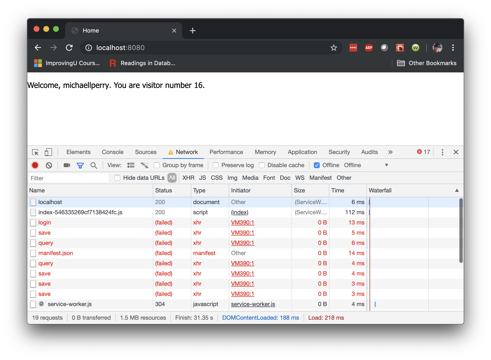
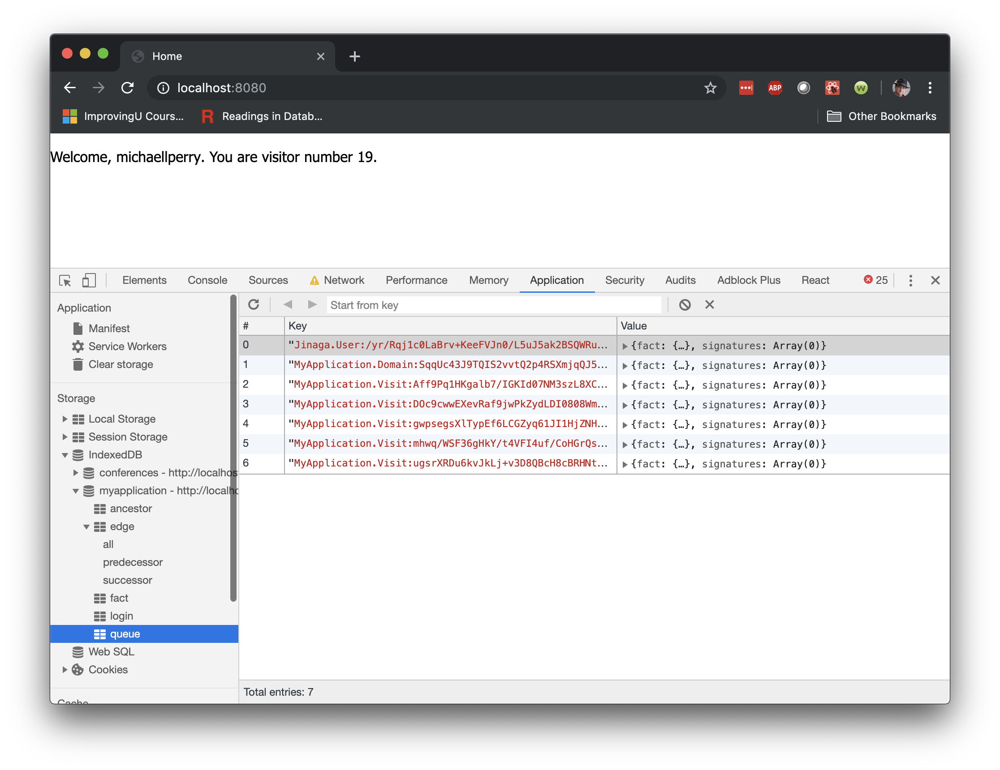
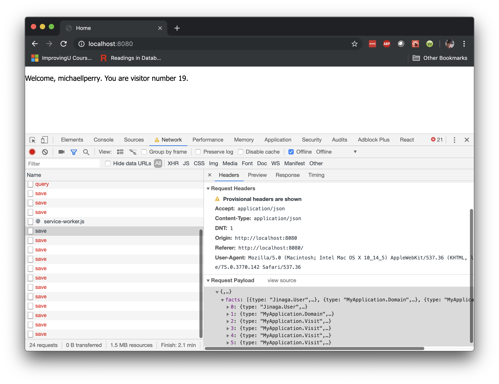

The reason for storing facts in IndexedDB is to support a PWA that is offline.
In the *Network* tab, you will find a checkbox labeled *offline*.
Check that box and refresh the page.
You will see a lot of network calls fail.
But yet the data appears in the app.
This data was loaded from the browser's database.

Refresh the page a few times.
Notice that the count continues to rise even while the page is offline.
A new visit is saved to the local database with each refresh, and the counter is served from those local facts.

Moreover, those facts are queued up to be sent to the server when the connection is restored.
These are in the IndexedDB collection called *queue*.

Looking at the *network* tab again, you can see that many of the failed attempts are *save* requests.
Drill into the payload of one of these *save* calls and you will see that it contains all of the facts in the queue.

When you uncheck the *offline* box, the next *save* request will send all of the facts to the server.
It will then empty the queue and stop retrying.